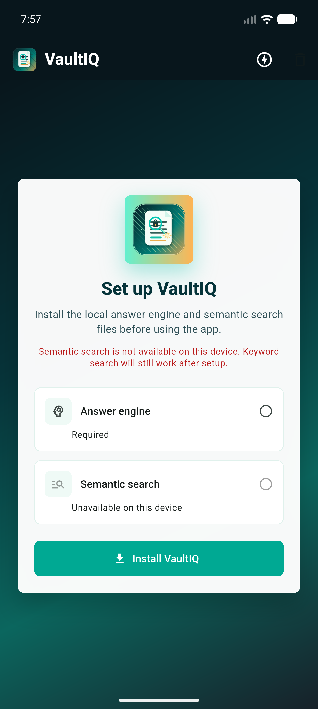

# VaultIQ

VaultIQ is an Android-first Flutter app for private document question answering. It imports local files, chunks and indexes their text on-device, retrieves relevant passages, and sends only local context to the on-device answer engine.



## Features

- First-run setup flow that downloads the local answer and retrieval dependencies into app-private storage.
- Local import for PDF, DOCX, Markdown, text, CSV, JSON, source-code, and other text-like files.
- Folder import on Android through the Storage Access Framework.
- SQLite-backed document, chunk, keyword, and embedding storage.
- Hybrid retrieval that combines semantic similarity, lexical ranking, metadata hints, and diversity filtering.
- Structured `[LocalDocQA]` logs around setup, extraction, chunking, retrieval, prompt construction, and generation.
- Synthetic public test corpus with PDFs, DOCX files, a manifest, and an answer key.

## Repository Layout

- `lib/` - Flutter app, controller, UI, local AI service, importers, storage, and ranking.
- `android/` - Android project and launcher assets for VaultIQ.
- `test/` - Unit tests for chunking, retrieval, prompt construction, embedding limits, and extraction.
- `integration_test/` - Device-oriented retrieval and RAG quality checks.
- `test_corpus/public_sample_docs/` - Public-safe sample PDFs, DOCX files, manifest, and answer key.
- `tools/generate_public_test_docs.py` - Regenerates the sample document corpus.
- `docs/quality/` - Previous RAG evaluation reports and raw result files.

## Requirements

- Flutter 3.44.0 or newer.
- Android SDK with an API 24+ target.
- A physical arm64 Android device is recommended for full local inference testing. Emulators are useful for UI and unit-level checks, but not all local inference assets are guaranteed to run there.
- Network access is required only for first-run dependency downloads.

## Local Development

```powershell
flutter pub get
flutter analyze
flutter test
```

Run on a connected Android device:

```powershell
flutter run -d <device-id>
```

Watch app logs:

```powershell
adb -s <device-id> logcat -v time | Select-String -Pattern "\[LocalDocQA\]|AndroidRuntime|FATAL EXCEPTION|PlatformException|E/flutter"
```

## Test Corpus

The sample corpus is synthetic and safe to publish. It exists to exercise import, chunking, retrieval, and answer quality:

```powershell
python tools/generate_public_test_docs.py
```

Use `test_corpus/public_sample_docs/answer_key.csv` as the expected-answer list for manual or automated quality runs.

